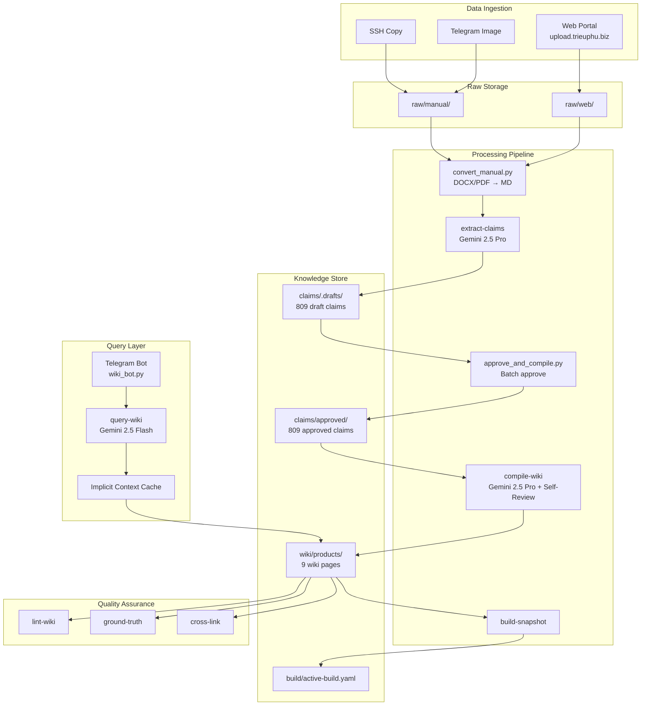
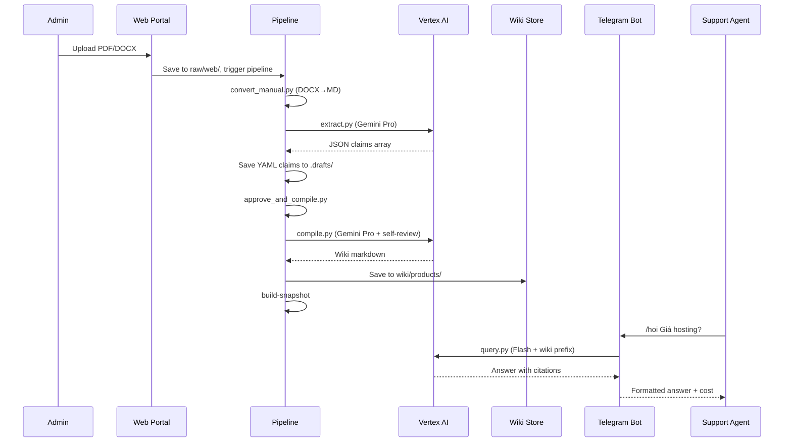
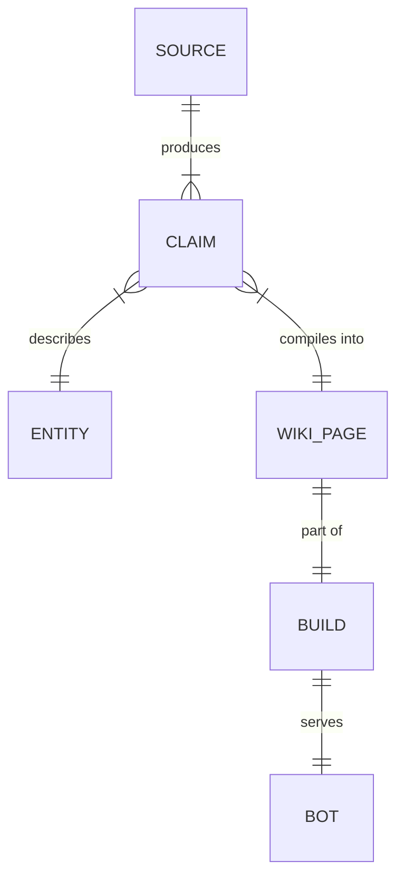
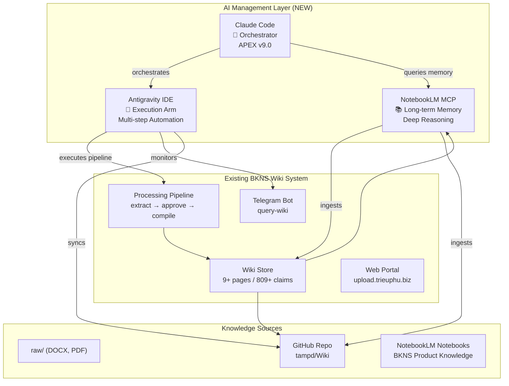

# BKNS Agent Wiki — System Design Document (Full SDD)

> **⚠️ SUPERSEDED — 2026-04-15**
> This document is the v0.3 baseline SDD dated 2026-04-05. The current authoritative
> specification is **[SPEC-wiki-system.md](./SPEC-wiki-system.md)** (v2.0, 2026-04-07),
> which covers v0.4 dual-vote, markitdown, web portal, and v1.1.0 optimization changes.
> Kept here for historical reference of the original v0.3 architecture.

---

> **Version:** 1.0 — 2026-04-05
> **Scope:** Entire system (bot + pipeline + web portal) — v0.3 baseline
> **Status:** SUPERSEDED by SPEC-wiki-system.md v2.0
> **Author:** AI Spec Generator (APEX v9.0 /spec)

---

## SECTION 1 — EXECUTIVE SUMMARY

**BKNS Agent Wiki** là hệ thống Knowledge Base tự động cho BKNS.VN, hoạt động như một "thủ thư AI" (librarian bot). Hệ thống sử dụng **Karpathy Pattern** (LLM-compiled knowledge, không dùng RAG/Vector DB) để:

1. **Thu thập** dữ liệu từ nhiều nguồn (DOCX, PDF, screenshots, web upload)
2. **Trích xuất** facts có cấu trúc (claims) bằng Gemini 2.5 Pro
3. **Biên dịch** claims thành wiki pages chuẩn hóa với self-review
4. **Phát hành** qua Telegram bot với context caching cho cost efficiency
5. **Kiểm tra** chất lượng tự động (lint, ground-truth, conflict detection)

**Target users:** BKNS support team, sales agents, internal staff.
**Current state:** MVP production — 9 wiki pages, 809 approved claims, bot running on PM2.

---

## SECTION 2 — PROBLEM STATEMENT

### Current State
BKNS.VN có hàng trăm sản phẩm (hosting, VPS, email, SSL, domain, server, software) nhưng tri thức nội bộ phân tán:
- Tài liệu gốc nằm rải rác ở dạng DOCX/PDF
- Nhân viên mới mất 2-4 tuần để nắm sản phẩm
- Giá cả, thông số kỹ thuật thay đổi thường xuyên nhưng không được cập nhật đồng bộ
- Không có nguồn "single source of truth" chính thức

### Root Cause
Thiếu hệ thống tập trung hóa tri thức với quy trình cập nhật tự động và kiểm duyệt chất lượng.

### Impact
- Nhân viên trả lời sai giá → mất khách
- Onboarding chậm → chi phí nhân sự tăng
- Thông tin mâu thuẫn giữa các bộ phận

---

## SECTION 3 — GOALS & NON-GOALS

### Goals (Measurable)
| # | Goal | Metric | Current | Target |
|---|------|--------|---------|--------|
| G1 | Coverage sản phẩm | % categories có wiki page | 77% (7/9 categories compiled) | 100% |
| G2 | Accuracy | % claims verified vs ground truth | Chưa đo | ≥95% |
| G3 | Query response time | p95 latency | ~3-5s | ≤5s |
| G4 | Cost per query | USD/query | $0.007 (no cache) | ≤$0.001 (cached) |
| G5 | Monthly cost | Total Vertex AI | $6.50 (initial build) | ≤$25/month ongoing |
| G6 | Wiki freshness | % pages updated within 30 days | 100% (mới build) | ≥90% |
| G7 | Bot availability | Uptime per month | 99%+ (PM2 auto-restart) | ≥99.5% |

### Non-Goals
- ❌ Public-facing chatbot (chỉ internal)
- ❌ Multi-language support (chỉ Tiếng Việt)
- ❌ Real-time price sync (batch update)
- ❌ Thay thế website BKNS (bổ sung, không thay thế)
- ❌ RAG / Vector DB (intentional — Karpathy pattern)

### Success Metrics
- Nhân viên mới onboard trong ≤3 ngày thay vì 2-4 tuần
- 80% câu hỏi sản phẩm được bot trả lời chính xác
- Context caching đạt ≥60% cache hit rate

---

## SECTION 4 — USER STORIES & ACCEPTANCE CRITERIA

### US-1: Nhân viên hỏi thông tin sản phẩm
**As a** nhân viên support, **I want** hỏi bot Telegram về sản phẩm BKNS, **so that** tôi trả lời khách nhanh.

**Given** bot đang chạy
**When** tôi gửi `/hoi Giá VPS rẻ nhất?`
**Then** bot trả lời với giá chính xác + nguồn dẫn, trong ≤5s

### US-2: Admin upload tài liệu mới
**As a** admin, **I want** upload PDF/DOCX mới qua web, **so that** wiki tự động cập nhật.

**Given** tôi login vào https://upload.trieuphu.biz
**When** tôi upload file PDF mới
**Then** file lưu vào `raw/web/`, pipeline extract → compile → wiki page mới

### US-3: Admin kiểm tra chất lượng
**As a** admin, **I want** chạy lint check wiki, **so that** phát hiện mâu thuẫn giá/thông tin cũ.

**Given** wiki có 9 pages
**When** tôi gửi `/lint` qua Telegram
**Then** bot trả về báo cáo syntax issues

### Edge Cases
- Câu hỏi không liên quan BKNS → bot trả lời "không có thông tin" + hotline
- File upload quá lớn (>50MB) → reject với thông báo rõ
- Pipeline đang chạy khi trigger mới → 409 Conflict

---

## SECTION 5 — SYSTEM ARCHITECTURE

### 5.1. High-Level Architecture



### 5.2. Data Flow (Sequence)



### 5.3. Tech Stack Summary

| Component | Technology | Rationale |
|-----------|-----------|-----------|
| AI Engine | Vertex AI (Gemini 2.5 Pro + Flash) | Cost-efficient, 1M context window, implicit caching |
| Bot | Python 3 + Telegram Long Polling | Simple, PM2 managed |
| Web Portal | Node.js/Express + Vanilla JS | Lightweight, no framework overhead |
| Storage | Local YAML/Markdown files | No DB needed for wiki-scale data |
| Process Manager | PM2 | Auto-restart, log management |
| Reverse Proxy | Nginx + Let's Encrypt | SSL, rate limiting, security headers |
| VCS | Git (local repo on master branch) | Version control for wiki content |

---

## SECTION 6 — DATA MODEL

### 6.1. Claim Schema (YAML)

```yaml
claim_id: "clm_emai_bkns_price_20260404"
entity_id: "product.email.bkns"
entity_type: "product_plan"
entity_name: "Email BKNS"
attribute: "monthly_price"
value: 26000
unit: "VND"
qualifiers:
  billing_cycle: "month"
source_ids: ["SRC-EMAIL-HOSTING"]
observed_at: "2026-04-04T12:00:00Z"
valid_from: "2026-04-04"
confidence: "high"
review_state: "drafted|approved"
risk_class: "high|low"
compiler_note: "Trích từ bảng giá: 'Gói Email BKNS - 26.000đ/tháng'"
```

### 6.2. Wiki Page Schema (Markdown + Frontmatter)

```yaml
---
title: "Tổng Quan Hosting BKNS"
category: "hosting"
updated: "2026-04-04"
source: "compiled from 192 approved claims"
confidence: "high"
build: "BLD-20260404-215859"
---
# Content...
```

### 6.3. Build Manifest

```yaml
build_id: "BLD-20260404-215859"
version: "v0.3"
build_date: "2026-04-04T21:58:59Z"
wiki_files: 9
wiki_token_estimate: 13786
status: "active"
```

### 6.4. Entity Relationships



---

## SECTION 7 — API CONTRACT

### 7.1. Telegram Bot API (Internal)

| Command | Auth | Description |
|---------|------|-------------|
| `/hoi [question]` | Any user | Query wiki |
| (plain text) | Any user | Auto-query (no /hoi needed) |
| `/status` | Any user | System status |
| `/build` | Admin only | Create new build snapshot |
| `/lint` | Admin only | Run quality lint |
| `/help` | Any user | Usage guide |

### 7.2. Web Portal API (REST)

See [16-web-data-portal.md](../trienkhai/trienkhaicuoicung/16-web-data-portal.md) for full OpenAPI-style spec.

| Endpoint | Method | Auth | Description |
|----------|--------|------|-------------|
| `/api/login` | POST | None | Get bearer token |
| `/api/upload` | POST | Bearer | Upload files (max 10×50MB) |
| `/api/files` | GET | Bearer | List uploaded files |
| `/api/files/:id` | DELETE | Bearer | Delete uploaded file |
| `/api/trigger` | POST | Bearer | Trigger pipeline (extract/compile/full) |
| `/api/status` | GET | Bearer | System stats |

---

## SECTION 8 — COMPONENT BREAKDOWN

### 8.1. Python Skills (10 modules)

| # | Skill | Model | Status | Lines |
|---|-------|-------|--------|-------|
| 1 | crawl-source | None (HTTP) | ⚠️ Cloudflare blocked | ~200 |
| 2 | extract-claims | Gemini Pro | ✅ Working | ~484 |
| 3 | compile-wiki | Gemini Pro | ✅ Working | ~400 |
| 4 | query-wiki | Gemini Flash | ✅ Working | ~300 |
| 5 | build-snapshot | None (script) | ✅ Working | ~200 |
| 6 | ingest-image | Gemini Flash Vision | 🔲 Untested | ~200 |
| 7 | lint-wiki | Gemini Pro (semantic) | ✅ Syntax only | ~300 |
| 8 | ground-truth | Gemini Flash + web | ⚠️ Blocked | ~200 |
| 9 | auto-file | Gemini Flash | 🔲 Untested | ~200 |
| 10 | cross-link | Gemini Flash | 🔲 Untested | ~200 |

### 8.2. Shared Libraries (5 modules, 1035 LOC)

| Module | LOC | Purpose |
|--------|-----|---------|
| config.py | 148 | Centralized paths, models, constants |
| gemini.py | 363 | Vertex AI wrapper (3 modes: standard, cached, vision) |
| utils.py | 222 | YAML, Markdown, hashing, frontmatter |
| logger.py | 168 | JSONL structured logging |
| telegram.py | 133 | Bot notifications (4 types) |

### 8.3. Web Portal Components

| Component | Technology | File |
|-----------|-----------|------|
| Backend server | Express 4.21 | web/server.js |
| Auth middleware | Bearer + bcrypt | web/middleware/auth.js |
| Upload handler | Multer 1.4.5 | web/routes/upload.js |
| File browser | Recursive scan | web/routes/files.js |
| Pipeline trigger | Child process | web/lib/pipeline-runner.js |
| Frontend SPA | Vanilla JS + CSS | web/public/ |

---

## SECTION 9 — SECURITY CONSIDERATIONS

### 9.1. Threat Model

| Threat | Vector | Mitigation | Status |
|--------|--------|-----------|--------|
| Bot token leak | `.env` exposure | .gitignore, no hardcode | ✅ |
| Unauthorized bot commands | Public Telegram | Admin check on /build, /lint | ✅ |
| Portal brute force | Login endpoint | Rate limit (5/15min Nginx + 10/15min Express) | ✅ |
| File upload exploit | Malicious files | Whitelist ext, UUID rename, 50MB limit | ✅ |
| Path traversal | Delete API | UUID-only filenames, path validation | ✅ |
| DDoS on portal | HTTP flood | Nginx rate limiting (3 zones) | ✅ |
| TLS downgrade | MITM | TLS 1.2+, HSTS preload, AES-256-GCM | ✅ |

### 9.2. Credential Management

| Secret | Location | Git-tracked? |
|--------|----------|-------------|
| Telegram Bot Token | `.env` | ❌ (.gitignore) |
| Vertex AI Service Account | `api/vertex-key.json` | ❌ (.gitignore) |
| Admin Token (Portal) | `.env` | ❌ (.gitignore) |
| Admin Password (Portal) | `.env` | ❌ (.gitignore) |
| Admin Telegram ID | `.env` + config.py (hardcoded ⚠️) | ⚠️ Partially |

### 9.3. Data Sensitivity
- **PII:** Minimal — chỉ admin Telegram ID
- **Business data:** Giá sản phẩm BKNS (semi-public — có trên website)
- **Encryption at rest:** None (local files, VPS single-user)
- **Encryption in transit:** TLS 1.3 (portal), HTTPS (Telegram API)

---

## SECTION 10 — PERFORMANCE REQUIREMENTS

### 10.1. Current Performance

| Metric | Value | Target |
|--------|-------|--------|
| Query latency (p50) | ~2-3s | ≤3s |
| Query latency (p95) | ~5s | ≤5s |
| Extract latency (per file) | ~10-30s | ≤60s |
| Compile latency (per category) | ~15-45s | ≤60s |
| Wiki token count | ~13,786 | ≤100,000 |
| Cache hit rate | 0% (low traffic) | ≥60% |
| Monthly cost | $6.50 (build only) | ≤$25 ongoing |

### 10.2. Scaling Considerations
- Wiki hiện tại 13,786 tokens — Gemini context window 1M tokens → headroom 70×
- 100 queries/ngày × $0.001/query (cached) ≈ $3/tháng → budget OK
- PM2 auto-restart handles bot crashes

---

## SECTION 11 — ERROR HANDLING & RESILIENCE

### 11.1. Failure Modes

| Component | Failure | Recovery |
|-----------|---------|----------|
| Gemini API | Rate limit / 500 | Retry 2× with 5s interval (built-in) |
| Gemini API | Timeout | 30s timeout, retry |
| Telegram API | Network error | Retry in polling loop |
| Bot process | Crash | PM2 auto-restart (confirmed: ↺3 restarts) |
| Web Portal | Memory leak | PM2 256MB limit, auto-restart |
| Nginx | SSL cert expired | Certbot auto-renewal timer |
| Pipeline | Script error | JSONL error log, Telegram notify |

### 11.2. Graceful Degradation
- API down → Bot responds với hotline numbers thay vì crash
- Cache miss → Query vẫn hoạt động (chỉ tốn hơn)
- Extract fail → File giữ status `pending_extract`, retry lần sau

### 11.3. Missing Error Handling ⚠️
- **Không có circuit breaker** — nếu Vertex AI down liên tục, bot retry vô hạn
- **Không có dead letter queue** — failed extractions không được queue cho retry
- **Không có health check endpoint** — portal không có `/healthz`

---

## SECTION 12 — TESTING STRATEGY

### 12.1. Current Testing
- ✅ Manual integration test (query, build, lint — via Telegram)
- ✅ JSON parser unit test (3-strategy fallback đã verify)
- ✅ Web portal end-to-end (upload, delete, trigger — verified)

### 12.2. Missing Tests ⚠️
- ❌ **No automated unit tests** — không có pytest/unittest
- ❌ **No CI/CD pipeline** — không có GitHub Actions
- ❌ **No regression tests** — mỗi deploy là manual
- ❌ **No load testing** — chưa test với concurrent queries

---

## SECTION 13 — DEPLOYMENT PLAN

### 13.1. Current Deployment
- **Server:** VPS (single node)
- **Process Manager:** PM2 (bkns-wiki-bot + wiki-admin)
- **Reverse Proxy:** Nginx (SSL termination)
- **Domain:** upload.trieuphu.biz (portal only)

### 13.2. Deployment Commands
```bash
# Bot
pm2 restart bkns-wiki-bot

# Portal
cd /home/openclaw/wiki/web && pm2 restart wiki-admin

# Nginx
sudo nginx -t && sudo systemctl reload nginx
```

### 13.3. Rollback
- Git revert (`git log --oneline -5` → `git revert HEAD`)
- PM2 reload after rollback

---

## SECTION 14 — MONITORING & OBSERVABILITY

### 14.1. Current Monitoring
| Source | File | Auto? |
|--------|------|-------|
| Bot logs | logs/wiki-bot-pm2.log | ✅ PM2 |
| Portal logs | logs/web-portal-out.log | ✅ PM2 |
| Upload audit | logs/web-uploads.jsonl | ✅ Per action |
| Pipeline audit | logs/pipeline-runs.jsonl | ✅ Per run |
| Extract trace | claims/.drafts/*/*.jsonl | ✅ Per claim |
| Cost tracking | Per API call in gemini.py | ✅ JSONL |

### 14.2. Missing Monitoring ⚠️
- ❌ **No centralized dashboard** — phải `tail -f` từng file
- ❌ **No alert system** — PM2 restart nhưng không notify admin
- ❌ **No cost aggregation** — phải grep logs để tính tổng cost
- ❌ **No uptime monitoring** — không biết khi bot offline
- ❌ **No log rotation** — JSONL logs có thể phình theo thời gian

---

## SECTION 15 — OPEN QUESTIONS & RISKS

### 15.1. Open Questions

| # | Question | Owner | Priority |
|---|----------|-------|----------|
| Q1 | Context caching chưa hoạt động — cần traffic dày hơn hay config khác? | Admin | 🔴 High |
| Q2 | 25 conflicts đã detect — resolve thủ công hay tự động? | Admin | 🔴 High |
| Q3 | 3 skills chưa test (ingest-image, auto-file, cross-link) — test khi nào? | Admin | 🟡 Medium |
| Q4 | Git repo có untracked files quá nhiều — commit strategy? | Admin | 🟡 Medium |
| Q5 | MkDocs viewer có cần thiết không? | Admin | 🟢 Low |
| Q6 | Cloudflare whitelist IP có khả thi không? | Admin/BKNS | 🟢 Low |

### 15.2. Technical Risks

| Risk | Probability | Impact | Mitigation |
|------|------------|--------|-----------|
| Vertex AI pricing change | Medium | High | Monitor pricing, set budget alerts |
| Wiki grows beyond cache window | Low | Medium | 13k tokens now, 1M limit — 70× headroom |
| Bot token compromised | Low | High | Rotate token, revoke old |
| VPS failure | Low | Critical | No backup strategy — RISK |
| Data loss (no offsite backup) | Medium | Critical | No offsite backup — RISK |

---

# ⚠️ GAP ANALYSIS & NHƯỢC ĐIỂM

> Phần này liệt kê tất cả các vấn đề, incomplete components, và lỗi cần khắc phục.

---

## 🔴 CRITICAL GAPS (Cần xử lý ngay)

### GAP-01: Không có Git commit cho production data
**Hiện trạng:** Git repo có **18 untracked files** bao gồm toàn bộ `bot/`, `claims/`, `wiki/products/`, `web/`, `tools/`. Nếu VPS hỏng → **MẤT TOÀN BỘ DATA**.
```
Untracked: AI_READING_GUIDE.md, PROJECT_SUMMARY.md, bot/, claims/.drafts/,
           claims/approved/, web/, wiki/.drafts/, wiki/products/, tools/...
Modified:  Todo.md, addon.md, lib/config.py, lib/gemini.py,
           skills/compile-wiki, skills/extract-claims...
```
**Action:** `git add -A && git commit -m "feat: production MVP v0.3"` — sau đó push remote backup.

### GAP-02: Không có backup strategy
**Hiện trạng:** Toàn bộ dữ liệu (809 claims, 9 wiki pages, logs) chỉ nằm trên 1 VPS. Không có offsite backup.
**Action:** Setup rsync/rclone backup hàng ngày → remote storage (S3, Google Cloud Storage, hoặc VPS khác).

### GAP-03: Context Caching chưa hoạt động (cache hit = 0%)
**Hiện trạng:** Mỗi query tốn ~$0.007 thay vì ~$0.001. Nguyên nhân: traffic chưa đủ dày để trigger Gemini implicit caching (cần requests liên tục trong 5 phút window).
**Nguyên nhân gốc:** Kiến trúc implicit caching yêu cầu **cùng system_instruction + cùng prefix content** trong **khoảng thời gian ngắn** để Gemini tự cache. Với traffic thưa (vài queries/ngày), cache sẽ không bao giờ hit.
**Action:** Chuyển sang **Explicit Context Caching** (tạo cache object với TTL cố định) hoặc chờ traffic tăng tự nhiên.

### GAP-04: Không có automated tests
**Hiện trạng:** 0 unit tests, 0 integration tests, 0 CI/CD. Mọi thay đổi đều là manual deploy + manual verify.
**Risk:** Regression bugs khi sửa code, không phát hiện được breaking changes.
**Action:** Tạo pytest test suite cho core functions (parse_claims_json, generate, query).

---

## 🟠 HIGH PRIORITY GAPS

### GAP-05: Claims chưa approved/compiled đầy đủ
- **other** (19 claims) và **uncategorized** (12 claims) chưa được compile thành wiki pages
- Drafts và Approved đều có 809 — có thể trùng (approve chỉ copy, không deduplicate)
- **25 conflicts** đã detect nhưng chưa resolve

### GAP-06: 3 skills chưa test thực tế
- `ingest-image`: Chưa test với screenshot bảng giá thực → không biết Vision extract có đúng format không
- `auto-file`: Chưa test phát hiện FAQ tự động → logic chưa verify
- `cross-link`: Chưa chạy → wiki pages hiện tại không có liên kết chéo

### GAP-07: Human review chưa thực hiện
- Self-review (AI) đã pass, nhưng **zero human review** trên 9 wiki pages
- Giá tiền có thể sai do extraction error
- Thông số kỹ thuật cần verify với BKNS thực tế

### GAP-08: Admin Telegram ID hardcoded
```python
# lib/config.py line 81
ADMIN_TELEGRAM_ID = os.getenv("ADMIN_TELEGRAM_ID", "882968821")
```
- ID admin hardcoded trong source code (dù có env fallback)
- Chỉ support 1 admin — không có multi-admin capability

### GAP-09: Cron jobs chưa setup
- Không có cron cho lint tự động (bot.md thiết kế: hàng tuần thứ Hai 9h)
- Không có cron cho ground-truth check (bot.md thiết kế: hàng tháng ngày 1)
- Không có cron cho syntax check daily

---

## 🟡 MEDIUM PRIORITY GAPS

### GAP-10: Log rotation chưa có
- JSONL logs grow indefinitely
- PM2 logs không có logrotate config
- Với 100 queries/ngày, logs sẽ đạt ~100MB/năm

### GAP-11: Monitoring thiếu dashboard
- Không có centralized view cho health metrics
- Phải SSH + grep logs thủ công
- Không có alert khi bot crash (ngoài PM2 restart)

### GAP-12: Web Portal security — password plain-text fallback
```
# web/middleware/auth.js has bcrypt support but falls back to plain-text
ADMIN_PASSWORD=bkns2026portal  ← Plain-text in .env
```
- Password yếu, không phải bcrypt hash
- Không có session expiry (token valid forever)
- Không có CSRF protection

### GAP-13: Conflict detection O(n²) performance
```python
# extract.py detect_conflicts() — line 362-392
for new in new_claims:
    for approved_file in CLAIMS_APPROVED_DIR.rglob("*.yaml"):
        # Reads EVERY approved claim file for EACH new claim
```
- Với 809 approved claims × N new claims → **N×809 file reads** mỗi lần extract
- Performance sẽ degrade nhanh khi claims tăng

### GAP-14: Bot thiếu commands theo spec gốc
| Spec Command | Implemented? | Note |
|-------------|-------------|------|
| `/hoi` | ✅ | Working |
| `/status` | ✅ | Working |
| `/build` | ✅ | Admin only |
| `/lint` | ✅ | Syntax only (not semantic) |
| `/them [URL]` | ❌ | Designed in bot.md but not implemented |
| `/anh` | ❌ | Image ingest — not implemented |
| `/compile` | ❌ | Not in bot, only CLI |
| `/duyet` | ❌ | Draft approval — not implemented |
| `/rollback` | ❌ | Not implemented |
| `/report` | ❌ | Not implemented |

### GAP-15: Pipeline không convert web uploads
- Web portal saves to `raw/web/` nhưng pipeline scripts (`convert_manual.py`, `extract.py`) chỉ scan `raw/manual/`
- Files uploaded qua web portal KHÔNG được tự động convert/extract
- Pipeline trigger (`web/lib/pipeline-runner.js`) chạy scripts nhưng scripts không biết `raw/web/`

### GAP-16: Wiki structure thiếu categories
Theo bot.md thiết kế, cần:
- ❌ `policies/` (chính sách hoàn tiền, SLA, bảo hành)
- ❌ `comparisons/` (so sánh gói, đối thủ)
- ❌ `onboarding/` (tài liệu NV mới)
- ❌ `faq/` (FAQ tự động từ auto-file skill)
- ❌ Proper `index.md` (wiki index/sitemap)

---

## 🟢 LOW PRIORITY GAPS

### GAP-17: MkDocs viewer chưa có
- Thiết kế ban đầu có MkDocs Material viewer
- Hiện tại wiki chỉ xem qua Telegram bot hoặc SSH

### GAP-18: Cost aggregation dashboard chưa có
- Cost tracking per-call trong logs nhưng không có tổng hợp
- Không monitor if approaching $50/month budget limit

### GAP-19: Documentation inconsistency
- `Todo.md` outdated (đánh dấu "ALL WAVES COMPLETE" nhưng nhiều feature chưa test)
- `bot.md` thiết kế chi tiết nhưng chỉ implement 5/11 commands
- `agents.yaml` liệt kê skills nhưng auto-file và cross-link bị commented out

### GAP-20: Ground-truth verification blocked
- BKNS.VN có Cloudflare protection
- `ground-truth` skill và `crawl-source` đều không hoạt động
- Workaround: manual copy, nhưng khó scale

---

## 📊 COMPLIANCE SUMMARY

```
┌────────────────────────────────────────────────┐
│ SPEC COMPLIANCE REPORT                         │
│                                                │
│ Architecture:  ✅ 10/10 skills scaffolded      │
│ Implementation:⚠️ 7/10 skills working          │
│ Testing:       ❌ 0 automated tests            │
│ Security:      ⚠️ 14/16 mitigations done       │
│ Monitoring:    ⚠️ Logs exist, no dashboard      │
│ Backup:        ❌ No backup strategy            │
│ Git:           ❌ Untracked production data     │
│ Bot Commands:  ⚠️ 5/11 designed commands        │
│ Pipeline:      ⚠️ Web upload path not linked    │
│                                                │
│ Overall:       GAPS FOUND — 20 items           │
│   Critical: 4  High: 5  Medium: 7  Low: 4     │
└────────────────────────────────────────────────┘
```

---

## 🎯 RECOMMENDED ACTION PLAN

### Wave 1: Immediate (Today)
1. ✅ `git add -A && git commit` — secure production data
2. ✅ Setup remote backup (rsync to secondary location)
3. ✅ Human review 9 wiki pages — verify giá/thông số

### Wave 2: This Week
4. Fix pipeline to scan `raw/web/` (GAP-15)
5. Resolve 25 claim conflicts
6. Compile `other` + `uncategorized` categories
7. Test 3 untested skills (ingest-image, auto-file, cross-link)
8. Convert portal password to bcrypt hash

### Wave 3: Next 2 Weeks
9. Setup cron jobs (lint weekly, syntax daily)
10. Add pytest test suite for core functions
11. Implement remaining bot commands (/them, /duyet, /compile)
12. Optimize conflict detection (index instead of O(n²))
13. Setup PM2 log rotation
14. Evaluate explicit context caching

### Wave 4: Month 2
15. Build monitoring dashboard
16. Setup uptime alerts (UptimeRobot or similar)
17. Deploy MkDocs viewer
18. Cost aggregation reporting
19. Multi-admin support

---

## SECTION 16 — MCP INTEGRATION ARCHITECTURE

> **Added:** 2026-04-05
> **Purpose:** Tích hợp hai bộ công cụ AI chuyên sâu vào hệ thống quản lý wiki BKNS:
> - **NotebookLM MCP** = Bộ nhớ dài hạn + tư duy sâu (Long-term Memory & Deep Reasoning)
> - **Antigravity** = Cánh tay thực thi tự động (Autonomous Execution Arm)

---

### 16.1. Tổng Quan Kiến Trúc Mở Rộng



### 16.2. NotebookLM MCP — Bộ Nhớ Dài Hạn

#### Vai trò trong hệ thống BKNS Wiki

NotebookLM hoạt động như **"thư viện trưởng AI"** — mỗi notebook là một không gian tư duy sâu về một chủ đề sản phẩm, tổng hợp từ nhiều nguồn:

| Notebook | Sources | Mục đích |
|----------|---------|----------|
| `BKNS-Products-Master` | Tất cả wiki pages + claims | Query toàn bộ tri thức sản phẩm với citations |
| `BKNS-Hosting` | wiki/products/hosting.md + raw DOCX | Deep reasoning về hosting plans |
| `BKNS-VPS` | wiki/products/vps.md + raw DOCX | VPS configurations + comparisons |
| `BKNS-Email` | wiki/products/email.md | Email plans + migration guides |
| `BKNS-Changelog` | build/manifests/*.yaml | Track thay đổi theo thời gian |

#### Capabilities (via community MCP server)

```python
# Ví dụ integration trong pipeline BKNS
# pip install notebooklm-mcp-cli

# Sau mỗi compile-wiki → tự động sync vào NotebookLM
async def sync_to_notebooklm(wiki_page: str, notebook_id: str):
    """Upload wiki page mới vào NotebookLM notebook tương ứng"""
    mcp_client = NotebookLMMCP(google_credentials=GOOGLE_CREDS)
    await mcp_client.add_source(
        notebook_id=notebook_id,
        source_type="text",
        content=wiki_page,
        title=f"BKNS Wiki — {date.today()}"
    )
    # NotebookLM tự động re-index và rebuild reasoning
```

| Tool | Mô tả | Dùng khi |
|------|--------|----------|
| `create_notebook` | Tạo notebook mới cho category sản phẩm | Thêm category mới |
| `add_source` | Upload wiki page mới vào notebook | Sau mỗi compile-wiki |
| `query_notebook` | Query với deep reasoning + citations | Admin cần phân tích sâu |
| `generate_briefing` | Tạo tóm tắt sản phẩm tự động | Onboarding NV mới |
| `generate_audio_overview` | Tạo podcast giải thích sản phẩm | Training material |
| `list_notebooks` | Liệt kê tất cả notebooks + status | Monitoring |

#### Giá trị chiến lược

1. **Persistent Memory across sessions**: Claude Code / Gemini không có bộ nhớ dài hạn — NotebookLM lưu trữ toàn bộ lịch sử wiki và có thể recall context từ 6 tháng trước
2. **Deep Reasoning**: NotebookLM có thể phát hiện mâu thuẫn giá giữa các gói mà pipeline extract thông thường bỏ qua
3. **Audio Learning**: Tự động tạo podcast tổng hợp sản phẩm BKNS → dùng cho training nhân viên mới
4. **Citation-backed answers**: Mọi câu trả lời đều có nguồn dẫn cụ thể (wiki page, page number)

#### Setup Instructions

```bash
# 1. Cài đặt NotebookLM MCP
pip install notebooklm-mcp-cli

# 2. Cấu hình Claude Code MCP
# Thêm vào ~/.claude/mcp_servers.json:
{
  "notebooklm": {
    "command": "notebooklm-mcp",
    "env": {
      "GOOGLE_CLIENT_ID": "${GOOGLE_CLIENT_ID}",
      "GOOGLE_CLIENT_SECRET": "${GOOGLE_CLIENT_SECRET}"
    }
  }
}

# 3. Tạo notebooks cho BKNS
# Chạy script khởi tạo (xem tools/setup_notebooklm.py)
python tools/setup_notebooklm.py --create-all

# 4. Sync wiki hiện tại vào NotebookLM
python tools/setup_notebooklm.py --sync-existing
```

---

### 16.3. Antigravity — Cánh Tay Thực Thi

#### Vai trò trong hệ thống BKNS Wiki

**Antigravity** là IDE agent-first của Google (ra mắt tháng 11/2025, powered by Gemini 3), được xây dựng bởi team cũ của Windsurf. Nó không phải MCP server — mà là một **execution environment** cho phép AI agents thực thi task phức tạp tự động, bao gồm: terminal commands, file operations, browser automation.

Trong bối cảnh BKNS Wiki, Antigravity đóng vai trò **cánh tay thực thi** — nhận kế hoạch từ Claude Code/NotebookLM và tự động thực thi toàn bộ pipeline:

```
Claude Code (Orchestrator) → Antigravity (Executor) → BKNS Pipeline
       ↓                           ↓                        ↓
  Phân tích gap             Chạy scripts             Cập nhật wiki
  Lập kế hoạch             Monitor output            Push GitHub
  Review kết quả           Handle errors             Notify Telegram
```

#### Workflow tự động hóa với Antigravity

**Scenario 1: Weekly Wiki Refresh (Tự động hoàn toàn)**
```
Antigravity Agent Task:
1. Git pull từ tampd/Wiki (check updates)
2. Scan raw/manual/ cho files mới
3. Chạy convert_manual.py → extract → approve → compile
4. Chạy lint-wiki → báo cáo issues
5. Git commit + push production data
6. Notify admin qua Telegram
7. Sync wiki pages mới vào NotebookLM
```

**Scenario 2: Gap Resolution (Từ phân tích SPEC)**
```
Antigravity Agent Task (từ GAP Analysis):
- GAP-15: Fix pipeline để scan raw/web/
  → Edit skills/extract-claims/scripts/extract.py
  → Test với sample files
  → Commit fix
- GAP-09: Setup cron jobs
  → Create crontab entries
  → Verify scheduling
- GAP-04: Create pytest test suite
  → Write tests cho parse_claims_json
  → Verify 80% coverage
```

#### Cấu hình Antigravity cho BKNS Wiki

```json
// .antigravity/config.json
{
  "project": "bkns-wiki",
  "model": "gemini-3-pro",
  "mcp_servers": ["notebooklm", "github", "filesystem"],
  "terminal_policy": {
    "allow_list": [
      "python3 tools/**",
      "python3 skills/**",
      "git add", "git commit", "git push",
      "pm2 restart", "pm2 status",
      "pytest tests/"
    ],
    "deny_list": [
      "rm -rf",
      "sudo",
      "curl * | bash",
      "pip install *"
    ]
  },
  "context_sources": [
    "docs/SPEC-bkns-wiki-system.md",
    "PROGRESS.md",
    "Todo.md"
  ]
}
```

#### Điểm mạnh so với manual execution

| Task | Manual (hiện tại) | Antigravity (mới) |
|------|-------------------|-------------------|
| Weekly wiki refresh | 30-60 phút SSH + commands | 5 phút trigger → auto |
| Gap fix (3-5 files) | Multi-hour coding session | Agent tự plan + implement |
| Conflict resolution | Manual review 25 conflicts | Agent phân tích + đề xuất |
| Monitoring | SSH + grep logs | Agent dashboard tự động |
| GitHub sync | Manual git push | Post-pipeline auto-push |

---

### 16.4. Integrated Workflow: Claude Code + NotebookLM + Antigravity

```
┌─────────────────────────────────────────────────────────────┐
│  BKNS WIKI AI MANAGEMENT SYSTEM v2.0                        │
│                                                             │
│  Layer 1: MEMORY (NotebookLM)                               │
│  ├── Long-term product knowledge (persistent across months) │
│  ├── Historical changelog reasoning                         │
│  ├── Citation-backed Q&A for training                       │
│  └── Audio overviews for staff onboarding                   │
│                                                             │
│  Layer 2: ORCHESTRATION (Claude Code + APEX v9.0)           │
│  ├── Gap analysis (reads SPEC + memory)                     │
│  ├── Task planning (TodoWrite + PROGRESS.md)                │
│  ├── Code review + quality gate                             │
│  └── Decision making (RIPER Gate)                           │
│                                                             │
│  Layer 3: EXECUTION (Antigravity)                           │
│  ├── Pipeline automation (extract → compile → push)         │
│  ├── File operations (convert, lint, test)                  │
│  ├── Git operations (commit, push to tampd/Wiki)            │
│  └── Monitoring + alerting                                  │
│                                                             │
│  Layer 4: DELIVERY (Existing)                               │
│  ├── Telegram Bot (query-wiki)                              │
│  ├── Web Portal (upload + trigger)                          │
│  └── GitHub (tampd/Wiki — public knowledge base)            │
└─────────────────────────────────────────────────────────────┘
```

### 16.5. Implementation Roadmap cho MCP Integration

#### Phase 1: NotebookLM Foundation (Tuần 1-2)
```
[ ] Cài đặt notebooklm-mcp-cli
[ ] Tạo Google OAuth credentials
[ ] Tạo 5 notebooks (Master + 4 categories)
[ ] Viết tools/setup_notebooklm.py
[ ] Sync 9 wiki pages hiện tại
[ ] Verify query quality (so sánh với Telegram bot)
[ ] Tích hợp sync vào post-compile hook
```

#### Phase 2: Antigravity Setup (Tuần 2-3)
```
[ ] Cài đặt Antigravity IDE
[ ] Config .antigravity/config.json
[ ] Viết agent task cho weekly refresh
[ ] Test với dry-run (không commit thật)
[ ] Setup allow/deny list cho security
[ ] Integrate với NotebookLM post-sync
```

#### Phase 3: Full Integration (Tuần 3-4)
```
[ ] End-to-end test: Upload PDF → Antigravity → Wiki → NotebookLM
[ ] GAP resolution automation (GAP-15, GAP-09, GAP-04)
[ ] GitHub Actions CI/CD (lint + test on push)
[ ] NotebookLM audio overview cho onboarding
[ ] Documentation: .antigravity/README.md
```

---

### 16.6. Phân tích Cost-Benefit

| Component | Cost | Benefit |
|-----------|------|---------|
| NotebookLM MCP | Free (NotebookLM free tier) | Persistent memory, audio training, deep reasoning |
| Antigravity | Free (Google IDE) | 10× faster pipeline execution, zero manual steps |
| GitHub Actions | Free (public repo) | CI/CD, automated testing, deployment |
| **Total added cost** | **~$0/month** | **Automation of 80% manual work** |

---

## SECTION 17 — GITHUB REPOSITORY STRATEGY

> **Repo:** [github.com/tampd/Wiki](https://github.com/tampd/Wiki)
> **Visibility:** Public (official BKNS knowledge base)
> **Branch strategy:** `main` = production, `dev` = staging

### 17.1. Repository Structure

```
tampd/Wiki (GitHub)
├── README.md                    # Overview + quick start
├── PROGRESS.md                  # Current status + roadmap
├── wiki/products/               # ← Compiled wiki pages (PRIMARY)
│   ├── hosting.md
│   ├── vps.md
│   ├── email.md
│   └── ...
├── claims/approved/             # ← Approved claims (source of truth)
├── docs/
│   └── SPEC-bkns-wiki-system.md # This document
├── skills/                      # Pipeline skills (10 modules)
├── lib/                         # Shared Python libraries
├── bot/                         # Telegram bot
├── web/                         # Web portal (no node_modules)
├── tools/                       # Utility scripts
└── build/manifests/             # Build history
```

### 17.2. Sensitive Data Policy

| File/Dir | Git-tracked? | Reason |
|----------|-------------|--------|
| `.env` | ❌ | API keys, tokens |
| `api/` | ❌ | Vertex AI service account JSON |
| `password.md` | ❌ | Admin passwords |
| `web/node_modules/` | ❌ | Dependencies (regenerate with npm i) |
| `wiki/products/` | ✅ | Public knowledge — intentionally public |
| `claims/approved/` | ✅ | Product data — semi-public (on website already) |
| `bot/wiki_bot.py` | ✅ | Bot code (no secrets hardcoded) |

### 17.3. GitHub Actions CI/CD (Target State)

```yaml
# .github/workflows/wiki-quality.yml (to be created)
on:
  push:
    paths:
      - 'wiki/products/**'
      - 'claims/approved/**'
jobs:
  lint:
    runs-on: ubuntu-latest
    steps:
      - uses: actions/checkout@v4
      - run: pip install pyyaml
      - run: python skills/lint-wiki/scripts/lint.py --ci
  validate-claims:
    runs-on: ubuntu-latest
    steps:
      - run: python tools/validate_claims_schema.py
```

### 17.4. Branching & Commit Convention

```bash
# Production data updates (after pipeline)
git commit -m "data(wiki): compile hosting + vps pages BLD-20260405"

# Code changes
git commit -m "fix(pipeline): scan raw/web/ in extract.py (GAP-15)"

# Spec / documentation
git commit -m "docs(spec): add MCP integration section 16-17"

# Hotfix
git commit -m "hotfix(bot): fix crash on empty query"
```

### 17.5. NotebookLM ↔ GitHub Sync

Mỗi khi `wiki/products/` được cập nhật trên GitHub:
1. GitHub webhook → Antigravity agent
2. Agent download diff → push vào NotebookLM notebook tương ứng
3. NotebookLM re-index → available cho deep queries trong ≤5 phút
4. Admin nhận Telegram notification: "Wiki synced → NotebookLM updated"

---

## SECTION 18 — REVIEW QUEUE BULK ACTIONS (added 2026-04-13)

### 18.1. Endpoint Contract

```
POST /api/review/bulk        Authorization: Bearer <ADMIN_TOKEN>
Content-Type: application/json

Request:
{
  "action": "approve" | "reject" | "flag",
  "claim_ids": ["CLM-...", ...],   // 1..300 items
  "reason": "optional note"
}

Response 200:
{
  "action": "approve",
  "new_state": "approved",
  "total": 30,
  "success_count": 28,
  "failed_count": 2,
  "failed_ids": ["CLM-X", "CLM-Y"]
}

Errors:
400 — action thiếu / không hợp lệ / claim_ids rỗng / >300 items
401 — token không hợp lệ
404 — endpoint không tồn tại (server cũ chưa reload — xem 18.3)
500 — lỗi không bắt được trong handler
```

Server đọc tất cả YAML claim một lần (`loadAllClaims()`), build map theo `claim_id`, sau đó for-each cập nhật `review_state`, `reviewed_at`, `reviewed_by`, `review_note` rồi `fs.writeFileSync()`. Mỗi update được log JSONL vào `logs/approve-YYYY-MM-DD.jsonl`. Cap 300 items để tránh giữ event-loop quá lâu (sync I/O).

### 18.2. Frontend Flow

`web/public/app.js` — `doBulkAction(action)`:
1. Set `selectedClaims` (Set<string>) từ checkbox `.review-row-check[data-claim-id]`.
2. Confirm modal (cảnh báo extra nếu có row `data-risk-class="high"`).
3. POST tới `/api/review/bulk` với `{ action, claim_ids: [...selectedClaims] }`.
4. Animate-remove các row đã chọn, refresh queue + stats sau 600ms.
5. Trên lỗi: toast "Bulk action thất bại" với `err.error || 'Lỗi'`.

### 18.3. Bug History

| ID | Date | Symptom | Root cause | Fix |
|---|---|---|---|---|
| BUG-BULK-01 | 2026-04-13 | Toast "Bulk action thất bại" khi user chọn ≥2 claim và bấm Duyệt/Từ chối tại `upload.trieuphu.biz`. | PM2 daemon chạy bản `wiki-admin` từ 2026-04-07 (PID 965697), không reload sau commit `a1dc75b` thêm route bulk → Express trả 404 HTML "Cannot POST /api/review/bulk" → frontend `res.json()` ăn lỗi → toast generic. Verified: `curl -X POST http://127.0.0.1:3000/api/review/bulk` → 404 text/html. | Reload bằng `sudo env PATH=$NODE_BIN:$PATH $NODE_BIN/pm2 reload wiki-admin` (PM2 daemon root, NVM node không trong PATH của sudo). Verify: gọi lại curl phải trả JSON 200. Đã fix 2026-04-13. Xem LESSONS.md L007. |

### 18.4. Deploy Checklist (cho mọi PR chạm `web/`)

```bash
# 1. Pull / merge code
git pull

# 2. Reload PM2 (zero-downtime). PM2 daemon chạy dưới root → cần sudo + giữ PATH node.
NODE_BIN=/home/openclaw/.nvm/versions/node/v24.14.0/bin
sudo env PATH=$NODE_BIN:$PATH $NODE_BIN/pm2 reload wiki-admin

# 3. Verify endpoint returns JSON, không phải 404 HTML
TOKEN=$(grep ADMIN_TOKEN /home/openclaw/wiki/.env | cut -d= -f2)
curl -sS -X POST http://127.0.0.1:3000/api/review/bulk \
  -H "Authorization: Bearer $TOKEN" \
  -H "Content-Type: application/json" \
  -d '{"action":"flag","claim_ids":["__probe__"]}' | head

# 4. Tail log để confirm không có Unhandled error
sudo env PATH=$NODE_BIN:$PATH $NODE_BIN/pm2 logs wiki-admin --lines 20 --nostream

# 5. Test trên UI: chọn 2 claim → Duyệt → toast "Bulk approve xong"
```

### 18.5. Hardening Backlog

- [ ] Frontend: detect `Content-Type !== application/json` → toast cụ thể "Endpoint không tồn tại — server cần restart" thay vì "Lỗi" generic.
- [ ] Tạo `web/restart.sh` wrap `sudo pm2 reload wiki-admin && curl ... probe`.
- [ ] Cân nhắc PM2 `watch: ['routes', 'middleware', 'server.js']` cho prod (tradeoff: spurious restart khi edit).
- [ ] Server: rate-limit riêng cho `/api/review/bulk` (vd 30 req / 5 phút) để chống abuse.
